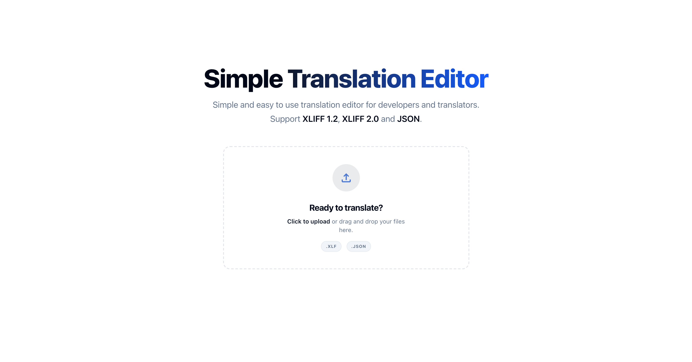

# Translation File Editor

A web-based editor for translation files, supporting **XLIFF 1.2**, **XLIFF 2.0**, and **JSON** (flat, nested, and Angular formats).

[Live Demo](https://translation-file-editor.vercel.app/)



Built with Angular, Tailwind CSS.

## Key Features

- **Multi-Format Support**: Parse and export XLIFF 1.2, XLIFF 2.0, and various JSON formats.
- **Quick Filtering & Search**: Instantly filter units by status (Total, Translated, Missing, Changed) and search through IDs, text, and notes.
- **100% Client-Side**: All processing happens entirely in the browser. Translation files are never uploaded to a server.

## Development

### Development server

To start a local development server, run:

```bash
ng serve
```

Once the server is running, open your browser and navigate to `http://localhost:4200/`. The application will automatically reload whenever you modify any of the source files.

## Building

To build the project run:

```bash
ng build
```

This will compile your project and store the build artifacts in the `dist/` directory. By default, the production build optimizes your application for performance and speed.

### Running unit tests

To execute unit tests with the [Vitest](https://vitest.dev/) test runner, use the following command:

```bash
ng test
```
